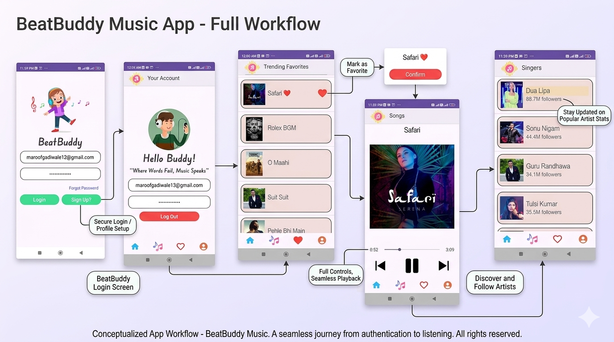

# BeatBuddy - Android Music Streaming Application

**BeatBuddy** is a sleek, user-centric music streaming mobile application built for Android. It offers a seamless experience for discovering trending music, following favorite artists, and managing a personalized music library with an intuitive and playful UI.



---

## 📱 Features

### 🔐 User Authentication & Personalization
* **Secure Access:** Integrated login and sign-up flow to protect user data.
* **Account Management:** Dedicated profile section to view account details and manage session state (Log Out).
* **Personalized Greeting:** Welcomes users back with a friendly, customized interface.

### 🎶 Music Discovery & Playback
* **Trending Favorites:** A curated list of the latest popular tracks featuring album art and quick-add favorite buttons.
* **Advanced Music Player:** A full-featured playback screen with high-quality album art, progress seek bars, and standard playback controls (Play/Pause, Next/Previous).
* **Singer Directory:** Explore a vast catalog of artists with real-time follower counts and artist profiles.

### 🎨 Modern UI/UX
* **Vibrant Design:** Clean, modern aesthetic with consistent iconography and a "playful music" theme.
* **Intuitive Navigation:** Bottom navigation bar for easy switching between Home, Music, Favorites, and Profile.

---

## 🛠️ Tech Stack

* **Language:** Java
* **Platform:** Android
* **Build System:** Gradle (Kotlin DSL)
* **UI Architecture:** XML-based layouts with custom drawable assets.

---

## 🚀 Getting Started

### Prerequisites
* Android Studio Jellyfish or later.
* Android SDK 34+.
* Java Development Kit (JDK) 17.

### Installation
1.  **Clone the repository:**
    ```bash
    git clone [https://github.com/maroofgadiwale/beatbuddy-music-app.git](https://github.com/maroofgadiwale/beatbuddy-music-app.git)
    ```
2.  **Open in Android Studio:**
    Launch Android Studio and select `Open an Existing Project`, then navigate to the cloned folder.
3.  **Sync Gradle:**
    Allow Android Studio to download dependencies and sync the project.
4.  **Run the App:**
    Connect an Android device or start an emulator and click the **Run** button.

---
## 👨‍💻 Developer

* **Maroof Gadiwale** – IT Student | Aspiring Data Scientist | ML Engineer ❤️

---

<div align="center">
  <p>⭐ Feel free to use! ⭐</p>
</div>
